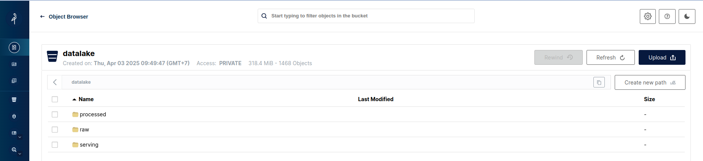
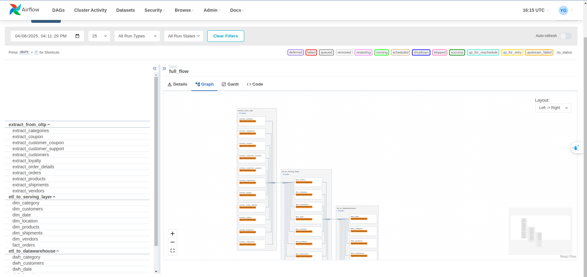

# On-prem Modern Data Warehouse with 6.000.000 records 

## Table of Contents
- [Introduction](#introduction)
- [Overview](#overview)
- [Architecture](#architecture)
- [Result](#result)

## Introduction
- This project's intention is to build an on-prem modern data warehouse architecture (The combination of Datalake and relational Datawarehouse) with a full pipeline from raw sources (OLTP, API, Images,...) to the useful sources Data Warehouse (BI and AI agent)
- The Pipeline leverages a combination of tools and services, including Apache Airflow, PostgreSQL, Apache Spark, Apache Kafka, Clickhouse, Minio, Superset, and an AI agent product.

## Overview
The Architecture is designed to:
1. Extract raw data from an OLTP database
2. Load data and load it into the raw layer in Data Lake (Minio)
3. From the raw layer, load data to the processed layer (Checking null, duplicates, and wrong data)
4. From the processed layer, load data to the serving layer (Transforming and modelling into the dimensional model)
5. From the serving layer, load data to the Data warehouse (Clickhouse server)
6. Using data in the Data Warehouse to create insightful and meaningful reports for sales, finance, customer,...
7. Creating an AI Agent product acts as a financial assistant to directly retrieve information from Data Warehouse and give thorough decisions for users.

## Architecture
1.**Data Architecture**:
  

2.**AI Agent Assistant flow**:
  

3.**Minio structure**:
  

4.**Airflow full flow dag**
  

